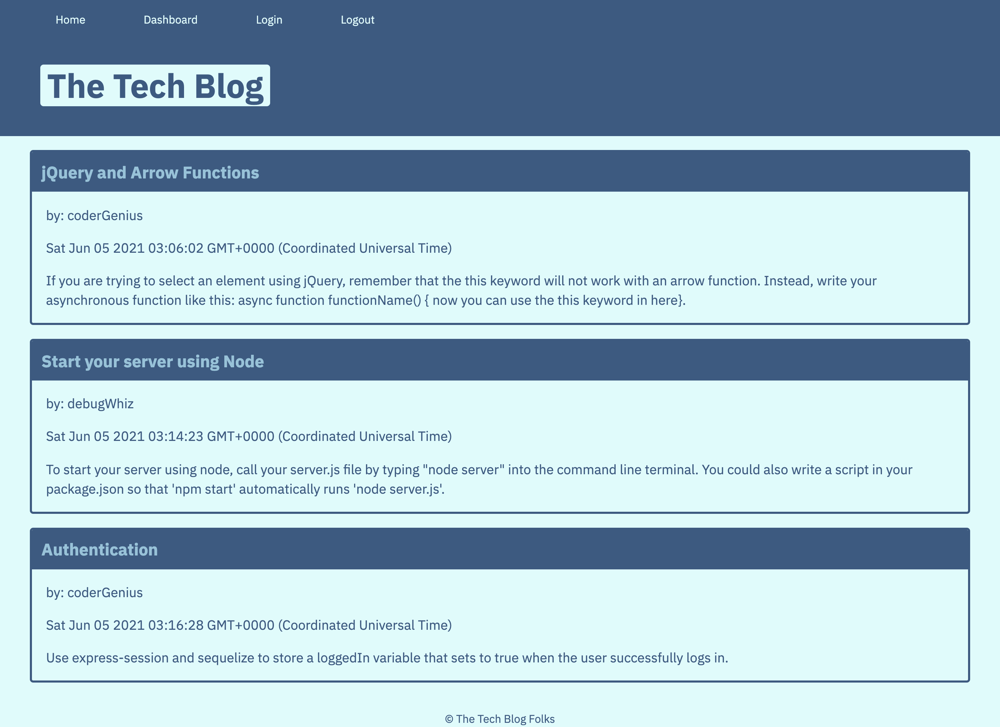

# tech-blog

## Description
This is a a CMS-style blog site similar to a Wordpress site, where developers can publish their blog posts and comment on other developers’ posts as well. The app is deployed on Heroku and follows the MVC paradigm in its architectural structure, uses Handlebars.js as the templating language, Sequelize as the ORM, and the express-session npm package for authentication.

### Functional Elements:

GIVEN a CMS-style blog site

- WHEN the user visits the site for the first time
THEN they are presented with the homepage, which includes existing blog posts if any have been posted; navigation links for the homepage and the dashboard; and the option to log in
- WHEN the user clicks on the homepage option
THEN they are taken to the homepage
- WHEN the user clicks on any other links in the navigation
THEN they are prompted to either sign up or sign in
- WHEN the user chooses to sign up
THEN they are prompted to create a username and password
- WHEN the user clicks on the sign-up button
THEN the user credentials are saved and they are logged into the site
- WHEN the user revisit the site at a later time and choose to sign in
THEN they are prompted to enter their username and password
- WHEN the user is signed in to the site
THEN they see navigation links for the homepage, the dashboard, and the option to log out
- WHEN the user clicks on the homepage option in the navigation
THEN they are taken to the homepage and presented with existing blog posts that include the post title and the date created
- WHEN the user clicks on an existing blog post
THEN they are presented with the post title, contents, post creator’s username, and date created for that post and have the option to leave a comment
- WHEN the user enters a comment and click on the submit button while signed in
THEN the comment is saved and the post is updated to display the comment, the comment creator’s username, and the date created
- WHEN the user clicks on the dashboard option in the navigation
THEN they are taken to the dashboard and presented with any blog posts they have already created and the option to add a new blog post
- WHEN the user clicks on the button to add a new blog post
THEN they are prompted to enter both a title and contents for their blog post
- WHEN the user clicks on the button to create a new blog post
THEN the title and contents of their post are saved and they are taken back to an updated dashboard with their new blog post
- WHEN the user clicks on one of their existing posts in the dashboard
THEN they are able to delete or update their post and taken back to an updated dashboard
- WHEN the user clicks on the logout option in the navigation
THEN they are signed out of the site
- WHEN the user is idle on the site for more than a set time
THEN they are able to view comments but they are prompted to log in again before they can add, update, or delete comments

## Usage
This application is delpyed through Heroku at the following link: https://thawing-scrubland-43977.herokuapp.com/

The page has the following appearance: 

## Technologies Used

* Node.js
* Express
* Handlebars
* Sequelize

## License

MIT License

Copyright (c) [2021] [Sue Jin Kim]

Permission is hereby granted, free of charge, to any person obtaining a copy of this software and associated documentation files (the "Software"), to deal in the Software without restriction, including without limitation the rights to use, copy, modify, merge, publish, distribute, sublicense, and/or sell copies of the Software, and to permit persons to whom the Software is furnished to do so, subject to the following conditions:

The above copyright notice and this permission notice shall be included in all copies or substantial portions of the Software.

THE SOFTWARE IS PROVIDED "AS IS", WITHOUT WARRANTY OF ANY KIND, EXPRESS OR IMPLIED, INCLUDING BUT NOT LIMITED TO THE WARRANTIES OF MERCHANTABILITY, FITNESS FOR A PARTICULAR PURPOSE AND NONINFRINGEMENT. IN NO EVENT SHALL THE AUTHORS OR COPYRIGHT HOLDERS BE LIABLE FOR ANY CLAIM, DAMAGES OR OTHER LIABILITY, WHETHER IN AN ACTION OF CONTRACT, TORT OR OTHERWISE, ARISING FROM, OUT OF OR IN CONNECTION WITH THE SOFTWARE OR THE USE OR OTHER DEALINGS IN THE SOFTWARE.